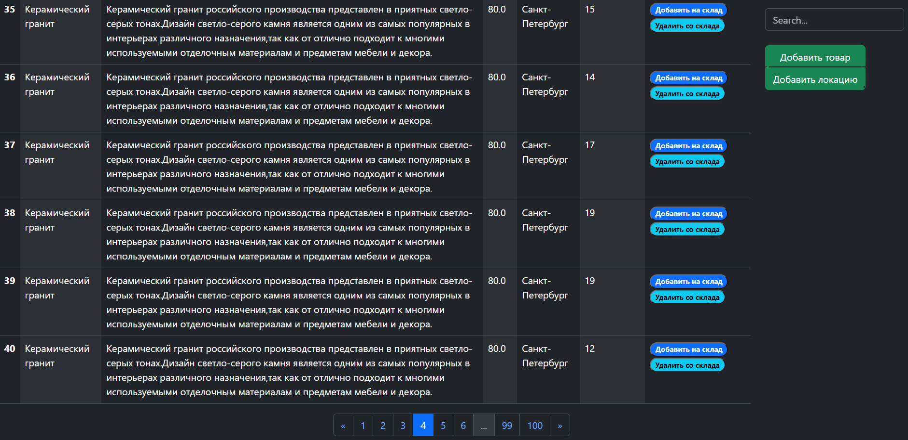

# Online Mininalize Shop

## Стек 
- Python, HTML, CSS, JavaScript, Boostrap, Flask, SQLAlchemy, MySQL

## Задачи по ТЗ
- [x] Создать базу данных
- [x] Создать приложение
- [x] Создать шаблоны страниц
- [x] Создать кнопки для товаров
- [ ] Реализовать изменения кнопок для товаров
- [ ] Обработка кнопок должна быть без обновления страницы(AJAX)

## Задачи с *
- [ ] Реализовать регистрацию и авторизацию
- [x] Добавить кнопку поиска и ее реализовать
- [x] Реализовать сортировку по всем параметрам

## Предварительные требования
- python3.12
- docker engine 24.0.7

## Инициализация
- создаем и заполняем .env
- Запускаем БД 
  ```bash
  docker compose up
  ```
- Создаем таблицы
  ```bash
  flask init-db
  ```
- Заполняем произвольными данными
- ```bash
  python random_dataset.py
  ```
- Запускаем приложение и переходим на `127.0.0.1:5000`
  ```bash
  flask run
  ```
  
## Результат
- ### home 
  
- ### inventory
  
  
## Обязательно читаем
- Flask уроки от Балакирева https://proproprogs.ru/flask
- Flask Doc https://flask.palletsprojects.com/en/3.0.x/
- Bootstrap Doc https://getbootstrap.com/docs/5.3/getting-started/introduction/
- JavaScript Doc https://developer.mozilla.org/en-US/docs/Web/JavaScript
- SQLAlchemy Doc https://docs.sqlalchemy.org/en/20/index.html#
- FlaskWTF Doc https://flask-wtf.readthedocs.io/en/1.2.x/quickstart/
- Flask paginate https://pypi.org/project/flask-paginate/
- Хороший шаблон проекта Django https://github.com/scb-am/abz_agency

## Быть внимательнее
- `/static` и 'static' в HTML возвращают разные URL при запросе конечных точек Bluebrint. 

## Мои выводы
- Как оказалось, SQLAlchemy ORM намного сложнее чем Core. Видимо orm нужно использовать для отслеживания и
  инициализации состояния объектов, потом уже сохранение изменений в БД. Вначале, я подумал что должно быть проще
  писать высокоуровневые методы orm, а не SQL запросы. Особенно эта разница заметна на миграции 1.4 -> 2.0.
